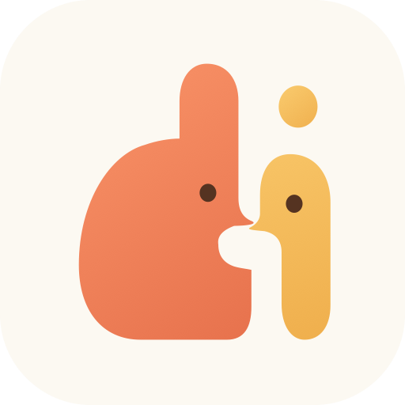
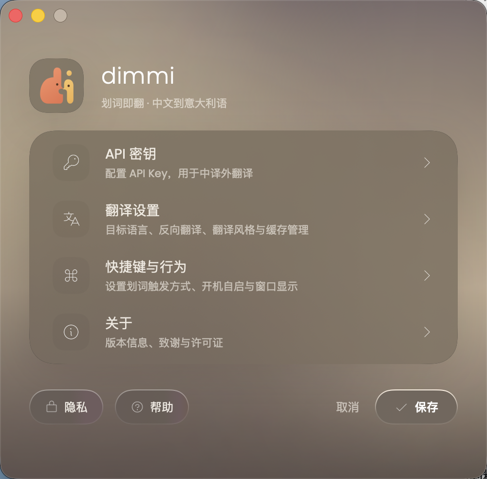
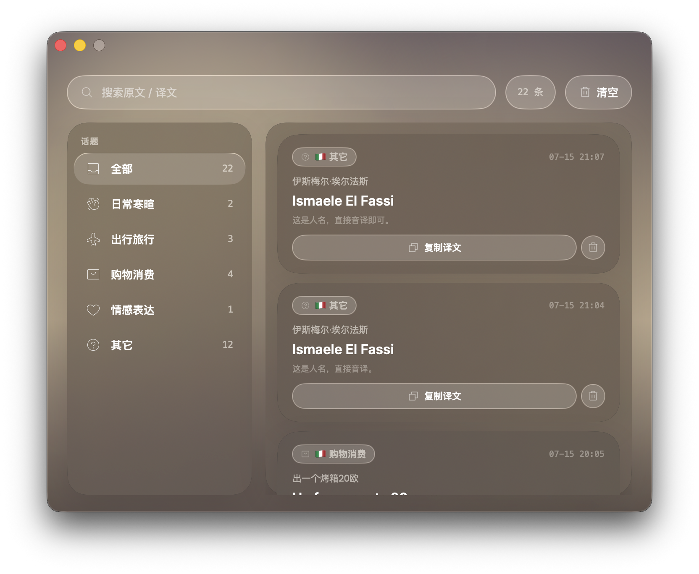

# dimmi

**划词即翻，但不止于翻译。**

为中文母语者设计的原生 macOS 菜单栏翻译器。  
复制或划选一段文字，dimmi 会在鼠标附近呈现自然译文与用法解析。

[推广页源文件](docs/index.html) · [隐私说明](PRIVACY.md) · [变更记录](CHANGELOG.md) · [上线检查](LAUNCH_CHECKLIST.md)

> [!NOTE]
> 当前为 GitHub 上线审阅稿。GitHub owner、仓库地址与公开范围确认后，才会创建远端仓库和启用正式下载链接。

## 为什么是 dimmi

传统翻译流程会把人从正在阅读或写作的地方带走：切窗口、打开网站、粘贴、等待，再回到原文。

dimmi 把这段流程压缩成一个动作：

- **复制即翻**：默认模式，按 <kbd>⌘C</kbd> 后浮卡在鼠标附近出现，不需要辅助功能权限。
- **划词即翻**：授权辅助功能后，完成鼠标选择即可触发。
- **留在语境里**：无需切换应用，卡片可拖动、可选择部分文本，点外或按 <kbd>Esc</kbd> 即可关闭。
- **不止主译文**：可选表达解析会补充短语拆解、语域说明与双语例句。
- **把查询变成表达库**：真实翻译自动保存在本机历史，可搜索、筛选、复制和删除。

“dimmi” 在意大利语中意为“告诉我”。

## 产品预览

<table>
  <tr>
    <td width="42%">
      
    </td>
    <td width="58%">
      
    </td>
  </tr>
  <tr>
    <td align="center">模型、语言、快捷键与行为设置</td>
    <td align="center">搜索、话题筛选与本地历史</td>
  </tr>
</table>

完整推广页位于 [docs/](docs/)。审阅通过后可直接将 <code>main /docs</code> 配置为 GitHub Pages 发布源。

## 已实现功能

| 能力 | 当前实现 |
|---|---|
| 触发方式 | 复制自动翻译、鼠标划词自动翻译、全局快捷键 |
| 翻译方向 | 中文 → 目标语言、目标语言 → 中文 |
| 目标语言 | 意大利语、英语、法语、德语、西班牙语、日语、韩语、葡萄牙语 |
| 翻译卡片 | 自适应高度、长内容滚动、自由选取文本、一键复制、拖动、重试、点外关闭 |
| 表达解析 | 短语拆解、用法说明、双语例句，可单独关闭与清理缓存 |
| 历史记录 | 本机 SwiftData、10 个话题、搜索、筛选、复制、单条删除、全部清空 |
| 快捷键 | 默认 <kbd>⌘⇧T</kbd> 正向、<kbd>⌘⇧B</kbd> 反向；支持录制、清除与恢复默认 |
| 行为设置 | 触发字符范围、冷却时间、自动关闭时间、开机启动 |
| 模型配置 | 21 家服务商 + 自定义 OpenAI-compatible 端点 |

### 模型生态

dimmi 当前提供以下配置入口：

- Anthropic Claude、OpenAI、DeepSeek、Google Gemini、xAI Grok
- Groq、Mistral AI、OpenRouter、Together AI、Fireworks AI
- 硅基流动、通义千问、Moonshot、智谱 GLM
- Perplexity、Cerebras、NVIDIA NIM、SambaNova、Cohere
- GitHub Models、Hugging Face
- 自定义 OpenAI-compatible 端点

Anthropic 使用 Messages API，其余预设使用 OpenAI Chat Completions 兼容协议。模型可用性、价格和地区限制以各服务商为准；自定义端点也可以连接兼容的本地模型或企业网关。

## 安装 Beta

### 系统要求

- macOS 15 或更高版本
- Apple Silicon 或 Intel Mac
- 一个模型服务商 API Key，或兼容的自定义端点

### 安装步骤

1. 从 GitHub Releases 下载 <code>dimmi-macOS.zip</code>。
2. 解压，将 <code>dimmi.app</code> 拖入“应用程序”。
3. 当前 Beta 尚未使用 Developer ID 签名和 Apple 公证。首次启动请在 Finder 中右键 <code>dimmi.app</code>，选择“打开”，再确认一次。
4. 点击菜单栏 dimmi 图标，进入“设置 → API 密钥”。
5. 选择服务商、填写自己的 API Key，测试连接并保存。
6. 默认复制即可触发；如需选完即翻，在“快捷键与行为”里切换到划词模式并授权辅助功能。

未填写 API Key 时，dimmi 默认显示本地示例结果用于体验界面；示例不会写入历史。

> [!WARNING]
> 自动复制翻译开启时，符合触发条件的新复制文本可能被发送给你选择的模型服务商。复制密码、访问令牌或私密内容前，请先暂停自动翻译。

## 隐私

dimmi 没有自建翻译中转服务器，也没有遥测或广告 SDK。

- 翻译请求由你的 Mac 直接发送到所选模型服务商或自定义端点。
- 默认复制模式不需要辅助功能权限；划词模式才会请求。
- 翻译历史与表达解析缓存在本机。
- 当前 Beta 的 API Key 保存在本机应用偏好中，**尚未使用 Keychain**；请勿在共享 macOS 账户中保存敏感密钥。
- 清空历史和清理表达解析缓存是两个独立操作。

完整说明见 [PRIVACY.md](PRIVACY.md)。

## 从源码构建

<pre><code>brew install xcodegen

# 通过 GitHub 的 Code 按钮复制你自己的仓库地址
git clone &lt;repository-url&gt;
cd dimmi

xcodegen generate
./tools/dev-rebuild.sh</code></pre>

要求 macOS 15+、Xcode 16+。SwiftPM 会拉取 PhosphorSwift 与 KeyboardShortcuts。

运行测试：

<pre><code>xcodebuild -project Frase.xcodeproj \
  -scheme dimmi \
  -configuration Debug \
  -derivedDataPath /tmp/dimmi-tests \
  CODE_SIGN_IDENTITY=- \
  test</code></pre>

生成本地 Release：

<pre><code>./tools/release-package.sh</code></pre>

> 本地 Release 使用带稳定 designated requirement 的 ad-hoc 签名，适合本机测试；公开可信分发仍需要 Developer ID 签名与 Apple notarization。

## 当前 Beta 的已知限制

- 尚未 Developer ID 签名或 Apple 公证。
- API Key 尚未迁移到 macOS Keychain。
- 没有账户、云同步、导出或跨设备同步。
- 不是离线翻译器；除自定义本地端点外，真实翻译需要网络。
- 安装包约 71–81MB，安装后约 100MB。

## 技术栈

- Swift 6 / SwiftUI / AppKit
- SwiftData
- Accessibility API 与 NSPasteboard
- PhosphorSwift
- KeyboardShortcuts
- Poppins / Inter

第三方组件与字体许可见 [THIRD_PARTY_NOTICES.md](THIRD_PARTY_NOTICES.md)。

## 参与项目

问题反馈、功能建议和提交规范会在 GitHub 仓库 owner 与公开范围确认后启用。提交问题时，请勿粘贴 API Key、私密原文或完整个人日志。

## License

仓库当前包含 [MIT License](LICENSE)。正式公开源码前，仍需由项目所有者确认版权署名与授权范围。

